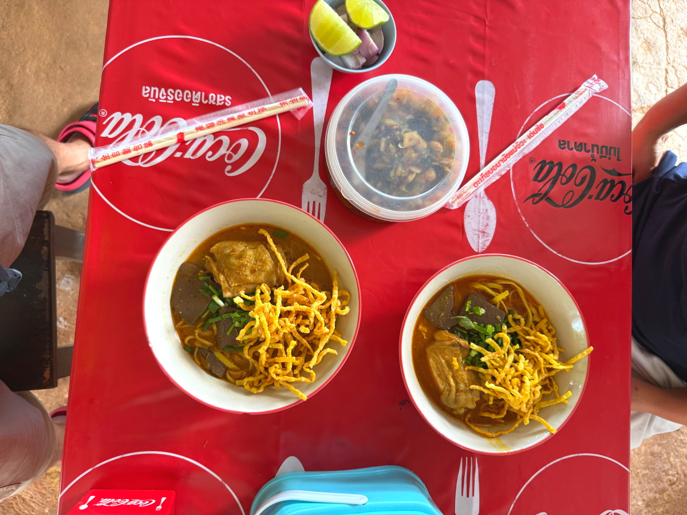
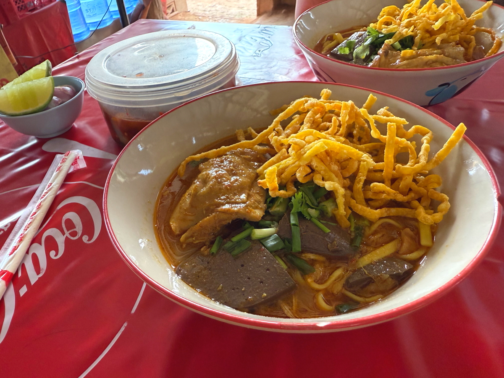
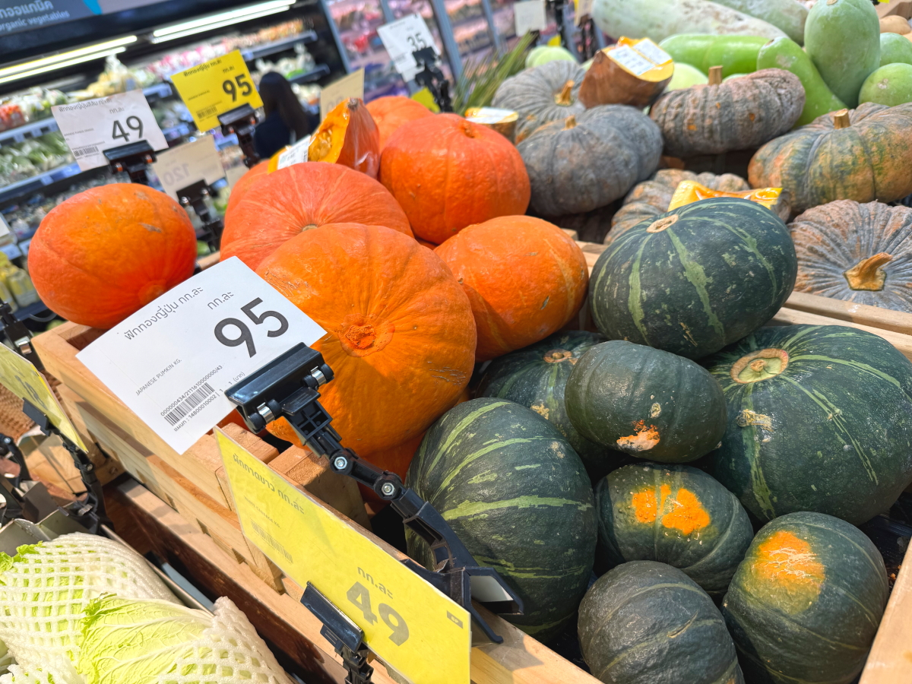

# 20251016_maechan

<html lang="ja" data-loaded="false" data-scrolled="false" data-spmenu="closed">
<head>

<meta charset="UTF-8">
<meta http-equiv="Content-Type" content="text/html; charset=UTF-8">
<meta http-equiv="X-UA-Compatible" content="IE=EmulateIE10" />
<meta http-equiv="X-UA-Compatible" content="IE=edge">

<meta name="viewport" content="width=device-width, initial-scale=1.0">

<!--ここから上はお決まりの定型文です-->

<!--ここからが表現の書式などを決めるcssという部分-->

<link href="https://cdnjs.cloudflare.com/ajax/libs/lightbox2/2.7.1/css/lightbox.css" rel="stylesheet">

</head>

<body>
    
<!--
    
<a href="https://torokoid.github.io/20250927_maechan/">Happy Birthday</a>><a href="https://torokoid.github.io/20250927__maechan/">Polis's Home></a>Polis's Home_2

-->

モバイル端末をお使いの場合は、画面を横向きにすると
背景画像の横方向がご覧頂けます。

<!--ここ上は、ほぼそのまま使います！-->

<!--QRコードの挿入例-->

 QR for Access

<marquee direction="left" scrollamount="20" width="30%">(^_^)/~Hada</marquee>

<!--流れ文字の挿入例-->
<h1><marquee behavior="left">!!! 2025/10/14-15、車の下でくつろぐネコちゃんから、夕食ではしゃぐ甥っ子まで !!!</marquee></h1>

                          

<!--ここから下が、本体部分-->
    

<h2>14,Oct,2025 車の下では強い陽射しを避けて猫がマッタリ〜</h2>

    
<h2>バナナはチップではなくて天ぷらになりました</h2>

    
<h2>親戚のコーヒーショップに寄ります</h2>

    
<h2>店の奥には噴水の池も見えています</h2>

    
<h2>お客さんは子連れのお父さん</h2>

    
<h2>修理依頼中のNISSANのディーラーに寄って車をチェック</h2>

    
<h2>信号脇のお花が満開</h2>

    
<h2>いつもの王立大学プールの花壇のお花も満開</h2>

    
<h2>プールでは競泳の練習中でした</h2>

    
<h2>コーチは緑のTシャツのお姉様</h2>

    
<h2>大学入り口のモニュメントと王様の写真</h2>

    
<h2>学生さんの背中には、なんとノミのプリント</h2>

    
<h2>夕方、野鳥たちが巣に帰る鳴き声が響きます</h2>

<iframe width="560" height="315" src="https://www.youtube.com/embed/CaE3VGh0oJY?si=C5DJyy9nJO-yHC7a" title="YouTube video player" frameborder="0" allow="accelerometer; autoplay; clipboard-write; encrypted-media; gyroscope; picture-in-picture; web-share" referrerpolicy="strict-origin-when-cross-origin" allowfullscreen></iframe>
    

<h2>晩御飯、PCの画面はストリートピアノの演奏YouTube</h2>

    
<h2>大学が休みに入って帰ってきたお兄ちゃんとはしゃぐ5歳児</h2>

    
<h2>15,Oct,2025 この日も車の下では猫ちゃんたちがマッタリ〜</h2>

    
<h2>お昼は近くのラーメン屋さんで済ませました</h2>

    
<h2>風除けのシートはISUZUの宣伝</h2>

    
<h2>ラーメンは一杯40バーツ ≒ 200円弱</h2>

    
<h2>おこぼれ狙いの犬は身重のメスでした</h2>

    
<h2>ラーメン屋さん全景</h2>

    
<h2>いつものLotus’sで知り合いにバッタリ</h2>

    
<h2>家電コーナーの冷蔵庫、HITACHI</h2>

    
<h2>SAMUSUNG</h2>

    
<h2>氷の上には鮮魚</h2>

    
<h2>熱帯エリアの畑の作物たち</h2>

    
<h2>ハロウィンが盛り上がってます</h2>

    
<h2>金価格が高騰中</h2>

    
<h2>雨の道路、正面に虹、よく見ないと見えないかも・・・</h2>

    
<h2>荷台に収まるワンちゃんたち</h2>

    
<h2>市場横の商店の神棚、右に居るのが店主のおじさん</h2>

    
<h2>市場の鮮魚店</h2>

    
<h2>その場でさばきます</h2>

    
<h2>ちびちゃんは夜も元気</h2>

    
<h2>ちびちゃんのご両親</h2>

    

    
<!--

<iframe width="560" height="315" src="https://www.youtube.com/embed/51tmW4PV-Xw?si=v7PtzTJ3WaY8o6uJ" title="YouTube video player" frameborder="0" allow="accelerometer; autoplay; clipboard-write; encrypted-media; gyroscope; picture-in-picture; web-share" referrerpolicy="strict-origin-when-cross-origin" allowfullscreen></iframe>
    

<iframe width="560" height="315" src="https://www.youtube.com/embed/MvsoLLa-XHQ?si=-zvqXbodBPV2nEFE" title="YouTube video player" frameborder="0" allow="accelerometer; autoplay; clipboard-write; encrypted-media; gyroscope; picture-in-picture; web-share" referrerpolicy="strict-origin-when-cross-origin" allowfullscreen></iframe>
    

<h2>Short movies</h2>
https://youtube.com/shorts/773yijDWNEM?feature=share 
https://youtube.com/shorts/fXWujjVeAQo?feature=share 
https://youtube.com/shorts/43kwtgxybM8?feature=share 
https://youtube.com/shorts/jKhX0RtXWAk?feature=share 
https://youtube.com/shorts/Fqw8KGuUPtA?feature=share 
https://youtube.com/shorts/ieJlzaTlpn0?feature=share 
https://youtube.com/shorts/z8YXZQyPVMA?feature=share 
https://youtube.com/shorts/1MxKGMEFFR4?feature=share 
-->

         

  
<h2>今日のBGMは森進一と森昌子さんの長男がボーカルを務めるワンオク フルVer One Ok Rock Wherever You Are　#oneokrock #ワンオク#whereveryouare</h2>

<iframe width="560" height="315" src="https://www.youtube.com/embed/DSlgDqjMSwQ?si=vJs-cPXPJLig3-U-" title="YouTube video player" frameborder="0" allow="accelerometer; autoplay; clipboard-write; encrypted-media; gyroscope; picture-in-picture; web-share" referrerpolicy="strict-origin-when-cross-origin" allowfullscreen></iframe>
    

   
<h2>車の下でくつろぐネコちゃんから、夕食ではしゃぐ甥っ子まででした Thank you for reading this far.</h2>

     
<h2>
<a href="https://torokoid.github.io/Mashiko_himawari_3/" target="_blank">クリックでメニューページに戻ります</a>
</h2>

    

   

<!-- hitwebcounter Code START -->
<a href="https://www.hitwebcounter.com" target="_blank">

you are visitor The numbers are cumulative for the Bangkok series websites launched since August 1st.
</a>   

         

  

      

<!--本体はここまで-->

<!--画面に空白地帯を作って、背景が見えるようにしています-->
                                              

<!-- フッタ -->
<footer>

Copyright 2025/10/16 S,Hada @Mae Chan

</footer>

<!--HPにさまざまなJavaScriptを呼び込むための書式-->

    
    </body>
    
</html>
